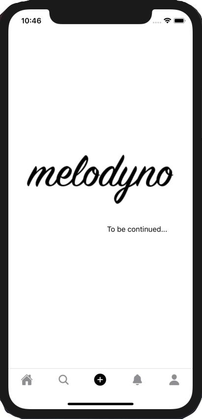
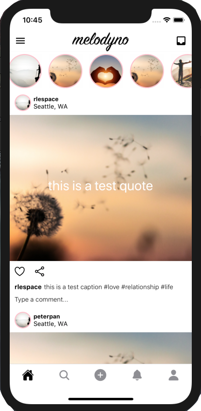
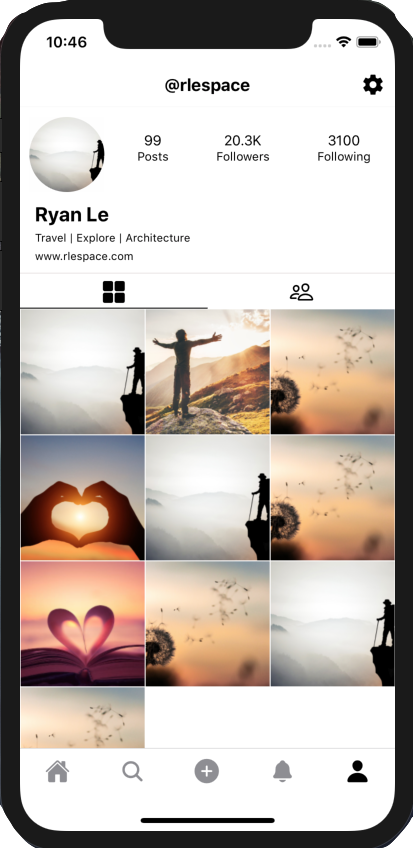

      
# Quick Start
Install dependencies
```
npm install
cd ios && pod install && cd ..
```
Run on iOS
```
react-native run-ios
```
Run on Android
```
react-native run-android
```

# Setup React Native Development Environment
System: Mac OS 10.13.6

## Installation
iOS: Latest Xcode and iOS Simulator

## Android SDK and AVD Install
Android: Android Studio / SDK / Emulator
Download and Install Android Studio
```
https://developer.android.com/studio
```
Open Android Studio
```
1. Go to Configure then SDK manager
2. Click "Show package details"
3. Enable Android 6.0 (Marshmallow), and INSIDE Marshmallow, enable
    a. Google APIs
    b. Android SDK platform 23
    c. Sources for Android 23
    d. Intel x86 Atom_64 System Image
    e. Google APIs Intel x86 Atom_64 System Image
4. Do the above for Android 7 and 8 as well (not necessary, but good to have for the future)
5. Next, on SDK tools tab, click "Show package details", look for "Android SDK Build-Tools", and make sure that 
    23.0.1 is selected
6. Click apply.
```
Append to ~/.bash_profile:
```
export ANDROID_SDK=/Users/<your_computer_name>/Library/Android/sdk
export PATH=/Users/<your_computer_name>/Library/Android/sdk/platform-tools:$PATH
```
and run `source ~/.bash_profile`
Create an AVD
```
1. Go to Configure then AVD manager
2. Click '+ Create Virtual Device'
```

## Install Node & NPM
Install NVM
```
curl -o- https://raw.githubusercontent.com/nvm-sh/nvm/v0.35.2/install.sh | bash
```
Add the variable in the bash profile.
```
~/.bash_profile
```
and add the following code in the profile
```
export NVM_DIR="$([ -z "${XDG_CONFIG_HOME-}" ] && printf %s "${HOME}/.nvm" || printf %s "${XDG_CONFIG_HOME}/nvm")"
[ -s "$NVM_DIR/nvm.sh" ] && \. "$NVM_DIR/nvm.sh" # This loads nvm
```
Install Node 
```
nvm install 10
```

## Setting Up ESLint
Source:
```
https://github.com/expo/eslint-config-universe
https://github.com/Intellicode/eslint-plugin-react-native
```
Run the following in the root directory:
```
yarn add --dev eslint prettier eslint-config-universe eslint-plugin-react eslint-plugin-react-native
```
Move this file to your project root https://gist.github.com/Rob117/118443a2610af3abcbb3d8ddb8a213d1
in your package.json, add the following line under "scripts"
```
"lint": "./node_modules/.bin/eslint --fix *.js **/*.js"
```

Run `npm run lint` to lint your code.

## Create New React Native Project
```
$ sudo npm install -g react-native-cli
$ react-native init <my_project_name> 	
```

## Installing testing tools
Jest - already installed
To run jest tests: 
```
npm test -- __tests__
```
